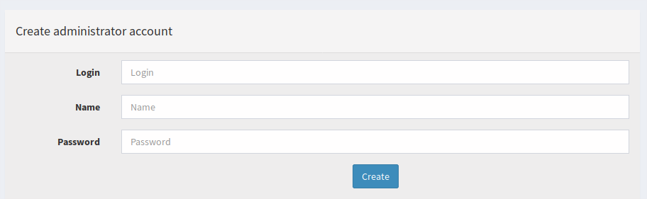
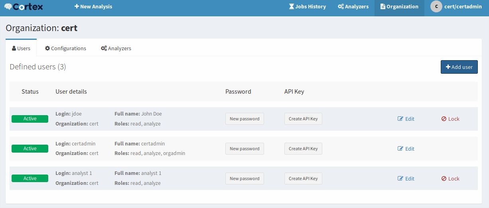
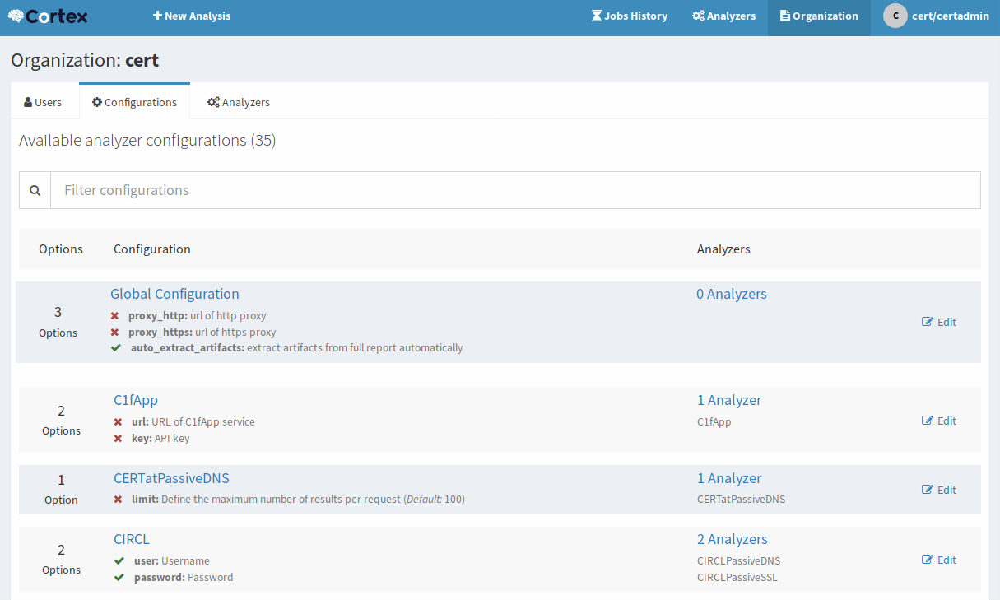
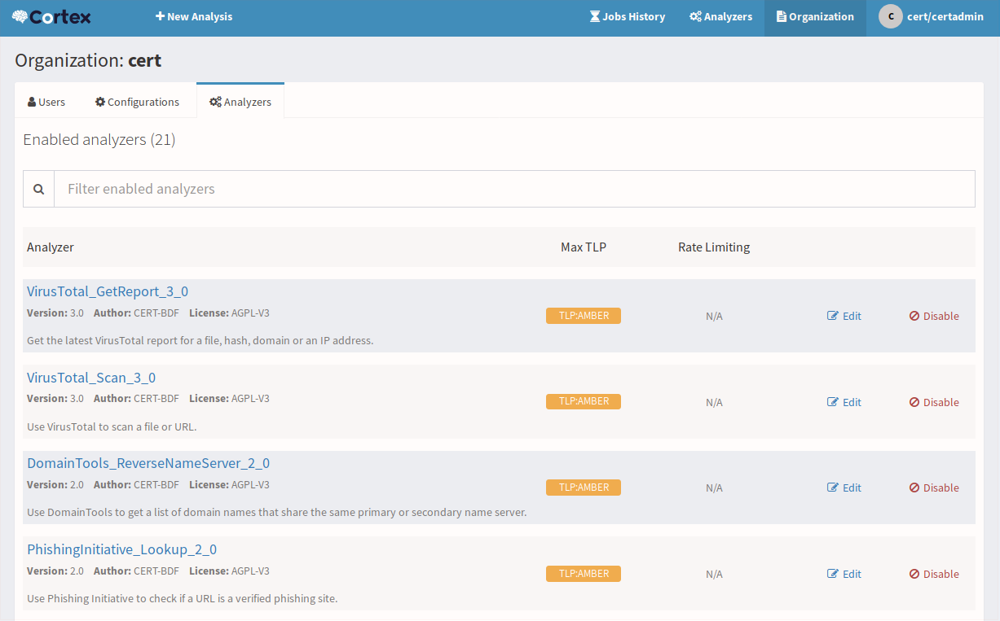

# User roles

In Cortex 2, 4 roles are defined:
 - `read`: the user can read all jobs information, including the report but he
can submit them. This role can't be used in `cortex` organization.
 - `analyze` (implies read role): the user can submit a new job using one of the
configured analyzer for its organization. This role can't be used in `cortex`
organization.
 - `orgAdmin` (implies analyze role): with this role, the user can manage users
of its organization. He can add user with role `read`, `analyze` and `orgAdmin`.
This role also permits to configure analyzers. This role can't be used in
`cortex` organization.
 - `superAdmin` (incompatible with other roles): this role only permits to manage
organizations and users. The first user is created with this role. Several users
can have this role but only on the `cortex` organization (which is automatically
created during installation).

| Actions\\Roles           | read | analyse | orgAdmin | SuperAdmin |
| ------------------------ | ---- | ------- | -------- | ---------- |
| Read reports             |  X   |    X    |    X     |            |
| Run jobs                 |      |    X    |    X     |            |
| Enable/Disable analyzer  |      |         |    X     |            |
| Configure analyzer       |      |         |    X     |            |
| Create org analyst       |      |         |    X     |     X      |
| Delete org analyst       |      |         |    X     |     X      |
| Create org admin         |      |         |    X     |     X      |
| Delete org admin         |      |         |    X     |     X      |
| Create Org               |      |         |          |     X      |
| Delete Org               |      |         |          |     X      |
| Create Cortex admin user |      |         |          |     X      |

## First access, configure Cortex administrator
If the database is not yet initialized (or initialized with obsolete data)
Cortex ask the user to migrate the database. This operation ensures that
database schema is up-to-date, then retrieves previous data (if any) and adapt
its format for the new schema.


At the end of this process, Cortex asks for the first user creation.



# Organizations, users and analyzers
In version 2 of Cortex, users and analyzers are managed in organizations. The
users (except superAdmins) can see only items hold by its organization. The
analyzers are configured and enabled per organization. So that an analyzer can
be configured with different API keys or rate limits in two organization.

## Organization
With `superAdmin` role, user can create organizations. Organization management
is done from "Organizations" menu.

The "cortex" organization has a special meaning. It is automatically created
when Cortex is initialized and can only contains `superAdmin` users.

Normal organizations hold users and analyzers.

**Delete Organization**

An organization cannot be really deleted, but it can be disabled. It that case,
all operation done by users in that organization are rejected. And disabled
organization can be reactivated by a superAdmin.

## User
Users can be created by superAdmins (for all organizations) and by orgAdmin (only
for his organization). User management is done in "Users" tab under
"Organization" menu.



**Delete Organization**

An user cannot be really deleted, but it can be locked.


## Analyzers
Analyzers can be configured only by `orgAdmin` users. In "Organization" menu,
the "Configurations" tab permits to define configuration item for all available
analyzers, including settings which is common to all analyzers (Global
Configuration). Some configurations affect several analyzers. Configuration of
analyzer doesn't use configuration file any longer. Now configuration is done
using the web interface.



The analyzer configuration can only be seen by `orgAdmin` users of the analyzer
organization. `superAdmin` cannot see how analyzers are configured.



In the "analyzer" tab, analyzers can be enable for the current organization. For
each of them, you can define a rate limit (maximum number of analyzes in the
specified period of time) and the maximum acceptable artifact TLP the analyzer
can process.

# Configuration
Analyzers are configured using web interface and are stored in the database but
system configuration are stored in the file `/etc/cortex/application.conf`

## Database

Cortex uses the Elasticsearch search engine to store all persistent data.
Elasticsearch is not part of Cortex package. It must be installed and configured
as a standalone instance which can be located on the same machine. For more
information on how to set up Elasticsearch, please refer to [Elasticsearch
installation guide]
(https://www.elastic.co/guide/en/Elasticsearch/reference/2.3/setup.html).

Three settings are required to connect to Elasticsearch:
 * the base name of the index
 * the name of the cluster
 * the address(es) and port(s) of the Elasticsearch instance

Defaults settings are:

```
# Elasticsearch
search {
  # Name of the index
  index = cortex
  # Name of the Elasticsearch cluster
  cluster = cortex
  # Address of the Elasticsearch instance
  host = ["127.0.0.1:9300"]
  # Scroll keepalive
  keepalive = 1m
  # Size of the page for scroll
  pagesize = 50
  # Number of shards
  nbshards = 5
  # Number of replicas
  nbreplicas = 1
  # Arbitrary settings
  settings {
    # Maximum number of nested fields
    mapping.nested_fields.limit = 100
  }
}
```

If you use a different configuration, modify the parameters accordingly in the
`application.conf` file.

If multiple Elasticsearch nodes are used as a cluster, addresses of the master
nodes must be used for the `search.host` setting. All cluster nodes must use the
same cluster name:

```
search {
    host = ["node1:9300", "node2:9300"]
   ...
```

Cortex uses the [TCP transport]
(https://www.elastic.co/guide/en/elasticsearch/reference/5.6/modules-network.html#_transport_and_http_protocols)
port (9300/tcp by default) and not the http port (9200/tcp).

Cortex versions index schema (mapping) in Elasticsearch. Version numbers are
appended to the index base name (the 8th version of the schema uses the index
`cortex_8` if `search.index = cortex`).

When too many documents are requested to Cortex, it uses the
[scroll](https://www.elastic.co/guide/en/elasticsearch/reference/5.6/search-request-scroll.html)
feature: the results are retrieved through pagination. You can specify the size
of the page (`search.pagesize`) and how long pages are kept in Elasticsearch
((`search.keepalive`) before purging.


## Analyzers
Cortex looks for installed analyzers by scanning directories configured in
`analyzer.path`. This item is multivalued.

Analyzer path should contain directories with JSON file. This file describe
analyzer (name, version, how to run it, ...).

You can control the number of simultaneous jobs with
`analyzer.fork-join-executor` configuration item. The value depends on the
number of CPU cores (`parallelism-factor` * nbCores), with a minimum
(`parallelism-min`) and a maximum (`parallelism-max`).

```
analyzer {
  # Directory that holds analyzers
  path = [
    "/path/to/default/analyzers",
    "/path/to/my/own/analyzers"
  ]

  fork-join-executor {
    # Min number of threads available for analyze
    parallelism-min = 2
    # Parallelism (threads) ... ceil(available processors * factor)
    parallelism-factor = 2.0
    # Max number of threads available for analyze
    parallelism-max = 4
  }
}
```
## Authentication

Cortex supports local, LDAP and Active Directory (AD) for authentication. By
default, it relies on local credentials stored in Elasticsearch.

Authentication methods are stored in the `auth.provider` parameter, which is
multi-valued. When a user logs in, each authentication method is tried in order
until one succeeds. If no authentication method works, an error is returned and
the user cannot log in.

Default values within the configuration file are:
```
auth {
	# "provider" parameter contains authentication provider. It can be multi-valued (useful for migration)
	# available auth types are:
	# services.LocalAuthSrv : passwords are stored in user entity (in Elasticsearch). No configuration is required.
	# ad : use ActiveDirectory to authenticate users. Configuration is under "auth.ad" key
	# ldap : use LDAP to authenticate users. Configuration is under "auth.ldap" key
	provider = [local]

  # By default, basic authentication is disabled. You can enable it by setting "method.basic" to true.
  method.basic = false

	ad {
		# The name of the Microsoft Windows domain using the DNS format. This parameter is required.
		#domainFQDN = "mydomain.local"

    # Optionally you can specify the host names of the domain controllers. If not set, Cortex uses "domainFQDN".
    #serverNames = [ad1.mydomain.local, ad2.mydomain.local]

		# The Microsoft Windows domain name using the short format. This parameter is required.
		#domainName = "MYDOMAIN"

		# Use SSL to connect to the domain controller(s).
		#useSSL = true
	}

	ldap {
		# LDAP server name or address. Port can be specified (host:port). This parameter is required.
		#serverName = "ldap.mydomain.local:389"

    # If you have multiple ldap servers, use the multi-valued settings.
    #serverNames = [ldap1.mydomain.local, ldap2.mydomain.local]

		# Use SSL to connect to directory server
		#useSSL = true

		# Account to use to bind on LDAP server. This parameter is required.
		#bindDN = "cn=cortex,ou=services,dc=mydomain,dc=local"

		# Password of the binding account. This parameter is required.
		#bindPW = "***secret*password***"

		# Base DN to search users. This parameter is required.
		#baseDN = "ou=users,dc=mydomain,dc=local"

		# Filter to search user {0} is replaced by user name. This parameter is required.
		#filter = "(cn={0})"
	}
}

# Maximum time between two requests without requesting authentication
session {
  warning = 5m
  inactivity = 1h
}
```

## Cache
In order to increase Cortex performance, cache is configured to prevent
repetitive database solicitation. Cache retention time can be configured for
users and organizations (default is 5 minutes). If an user is updated, cache is
automatically invalidated.

Job report can also be cached. If an analyzer is used with the same artifact,
the previous report can return without rerun the analyze. The cache is used only
if the second job occurs at most `cache.job` (default 10 minutes)
```
cache {
  job = 10 minutes
  user = 5 minutes
  organization = 5 minutes
}
```

## Streaming (a.k.a The Flow)
The user interface is automatically updated when data is changed in the
back-end. To do this, the back-end sends events to all the connected front-ends.
The mechanism used to notify the front-end is called long polling and its
settings are:

 * `refresh` : when there is no notification, close the connection after this
 duration (the default is 1 minute
 * `cache` : before polling a session must be created, in order to make sure no
 event is lost between two polls. If there is no poll during the cache setting,
 the session is destroyed (the default is 15 minutes).
 * `nextItemMaxWait`, `globalMaxWait` : when an event occurs, it is not
 immediately sent to the front-ends. The back-end waits nextItemMaxWait and up
 to globalMaxWait in case another event can be included in the notification.
 This mechanism saves many HTTP requests.

Default values are:
```
# Streaming
stream.longpolling {
  # Maximum time a stream request waits for new element
  refresh = 1m
  # Lifetime of the stream session without request
  cache = 15m
  nextItemMaxWait = 500ms
  globalMaxWait = 1s
}
```

### Entity size limit
The Play framework used by Cortex sets the HTTP body size limit to 100KB by
default for textual content (json, xml, text, form data) and 10MB for file
uploads. This could be too small in most cases so you may want to change it with
the following settings in the `application.conf` file:

```
# Max textual content length
play.http.parser.maxMemoryBuffer=1M
# Max file size
play.http.parser.maxDiskBuffer=1G
```

*Note*: if you are using a NGINX reverse proxy in front of Cortex, be aware
that it doesn't distinguish between text data and a file upload. So, you should
also set the `client_max_body_size` parameter in your NGINX server configuration
to the highest value among the two: file upload and text size defined in Cortex
`application.conf` file.


## HTTPS
To enable HTTPS in the application, add the following lines to
`/etc/cortex/application.conf`:
```
    https.port: 9443
    play.server.https.keyStore {
      path: "/path/to/keystore.jks"
      type: "JKS"
      password: "password_of_keystore"
    }
```
As HTTPS is enabled, HTTP can be disabled by adding `http.port=disabled` in
configuration.

To import your certificate in the keystore, depending on your situation, you can
follow [Digital Ocean's tutorial](https://www.digitalocean.com/community/tutorials/java-keytool-essentials-working-with-java-keystores).

**More information**:
This is a setting of the Play framework that is documented on its website.
Please refer to [https://www.playframework.com/documentation/2.6.x/ConfiguringHttps](https://www.playframework.com/documentation/2.6.x/ConfiguringHttps).
