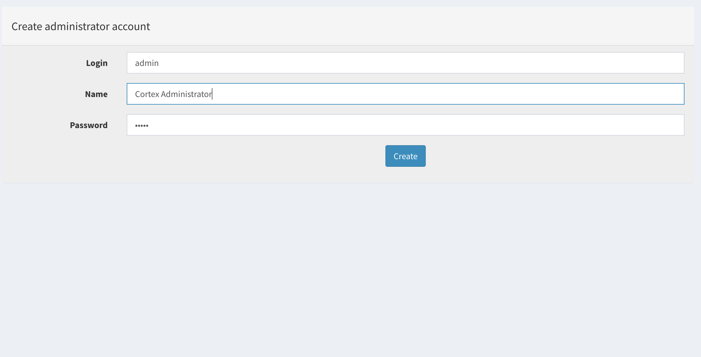
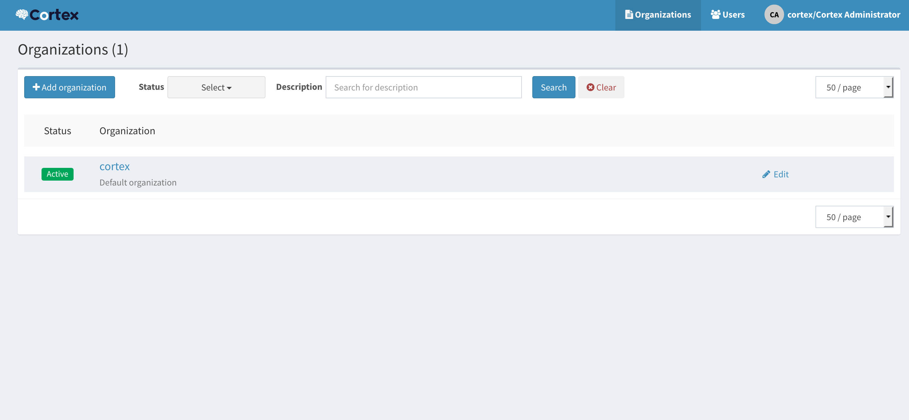
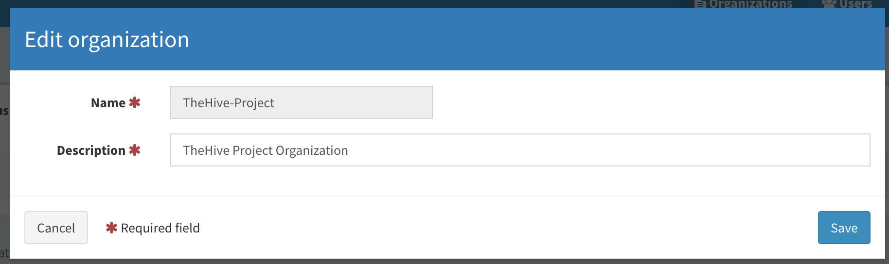
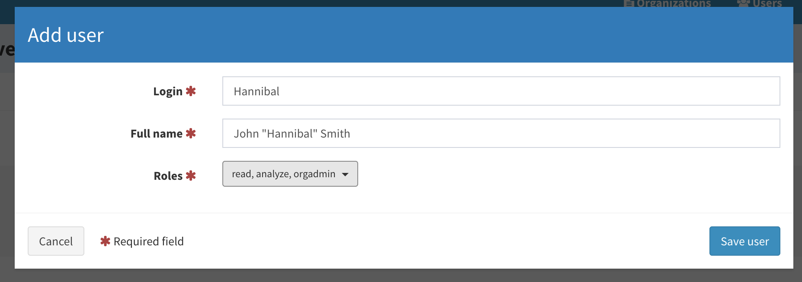
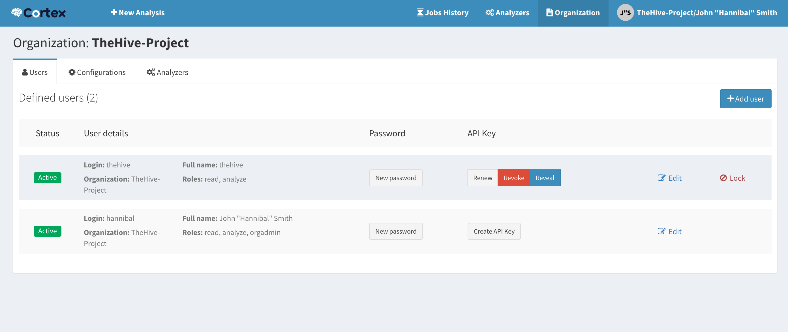
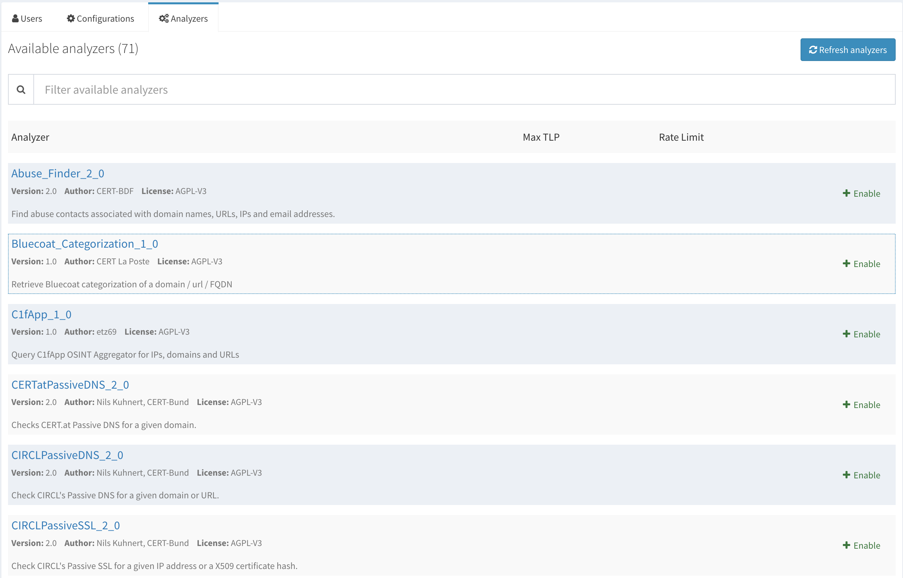

# Quick Start Guide
This is the Quick Start guide for Cortex 2. It assumes that Cortex [has been installed](../installation), and that [the analyzers](../installation/install-guide.md#analyzers-1) have been installed as well. For further details and configuration options, please refer to the [Administration Guide](admin-guide.md).

## Table of Contents
  * [Step 1: Setup Cortex](#step-1-setup-cortex)
  * [Step 2: Update the Database](#step-2-update-the-database)
  * [Step 3: Create the Cortex Super Administrator](#step-3-create-the-cortex-super-administrator)
  * [Step 4: Create an Organization](#step-4-create-an-organization)
  * [Step 5: Create a Organization Administrator](#step-5-create-a-organization-administrator)
  * [Step 6: Enable and Configure Analyzers](#step-6-enable-and-configure-analyzers)
  * [Step 7 (Optional): Create an Account for TheHive integration](#step-7-optional-create-an-account-for-thehive-integration)
  * [Migrating from Cortex 1\.x?](#migrating-from-cortex-1x)
  * [Need to Go Further?](#need-to-go-further)

## Step 1: Setup Cortex
The Cortex back-end configuration file is `/etc/cortex/application.conf` by default. In order to start Cortex and provided Elasticsearch is running on the same machine, the only required parameter to get up and running is the key of the server
(`play.http.secret.key`). This key is used to authenticate the cookies that
contain data, and not only a session ID. If Cortex runs in cluster mode, all
instances must share the same key.

To generate a key, use the following command line:

```
(cat << _EOF_
# Secret key
# ~~~~~
# The secret key is used to secure cryptographics functions.
# If you deploy your application to several instances be sure to use the same key!
play.http.secret.key="$(cat /dev/urandom | tr -dc 'a-zA-Z0-9' | fold -w 64 | head -n 1)"
_EOF_

search.host = ["127.0.0.1:9300"]
analyzer.urls = ["/opt/Cortex-Analyzers/analyzers"]

) | sudo tee -a /etc/cortex/application.conf

```

Please note that this secret key is mandatory to start the Cortex application. After saving the file, restart the application (`service cortex restart` on Ubuntu). 

**Important Note**: Elasticsearch must be installed in order for Cortex to work. If you need to install it or if you are using an Elasticsearch instance that is not on the same machine as Cortex, please refer to the [Administration Guide](admin-guide.md#database).

## Step 2: Update the Database
Cortex uses ElasticSearch to store users, organizations and analyzers configuration. The first time you connect to the Web UI (`http://<CORTEX_IP>:9001` by default), you have to create the database by clicking the `Update Database` button.


### Step 3: Create the Cortex Super Administrator
You are then invited to create the first user. This is a Cortex global administration user or `superAdmin`. This user account will be able to create Cortex organizations and users.



You will then be able to log in using this user account. You will note that the default `cortex` organization has been created and that it includes your user account, a Cortex global admininistrator.



## Step 4: Create an Organization

The default `cortex` organization cannot be used for any other purpose than managing global administrators (users with the `superAdmin` role), organizations and their associated users. It cannot be used to enable/disable or configure analyzers. To do so, you need to create your own organization inside Cortex by clicking on the `Add organization`  button.



## Step 5: Create a Organization Administrator

Create the organization administrator account (user with an `orgAdmin` role).



Then, specify a password for this user. After doing so,  log out and log in with that new user account.

## Step 6: Enable and Configure Analyzers
Enable the analyzers you need, configure them using the **Organization** > **Configuration** and **Organization** > **Analyzers** tabs. All analyzer configuration is done using the Web UI, including adding API keys and configuring rate limits.

The analyzer configuration requirements are detailed in the [Analyzer Requirements](../analyzer_requirements.md) page.

## Step 7 (Optional): Create an Account for TheHive integration

If you are using TheHive, create a new account inside your organisation with the `read, analyze` role and generate an API key that you will need to add to TheHive's configuration as described in TheHive's [Configuration Guide](https://github.com/TheHive-Project/TheHiveDocs/blob/master/admin/configuration.md#6-cortex). Please note that you need at least TheHive 3.0.7 (Cerana 0.7) to use Cortex 2 from TheHive.



## Migrating from Cortex 1.x?

If you are migrating from Cortex 1.x, we recommend that you:

1. Save the configuration of your analyzers (which ones are enabled and what are their configuration items such as users/passwords or API keys).
2. Install Cortex 2.
3. Edit `/etc/cortex/application.conf` to add the secret key as shown in Step 1 and point Cortex to the location of the analyzers.
3. Follow the remaining steps of this Quick Start Guide to enable the analyzers you need and reinject their configuration.
```
play.http.secret.key="..."
search.host = ['127.0.0.1:9300']
analyzer.path = ["/opt/Cortex-Analyzers/analyzers"]
```



## Need to Go Further?
For further details and configuration options, please refer to the [Administration Guide](admin-guide.md).
